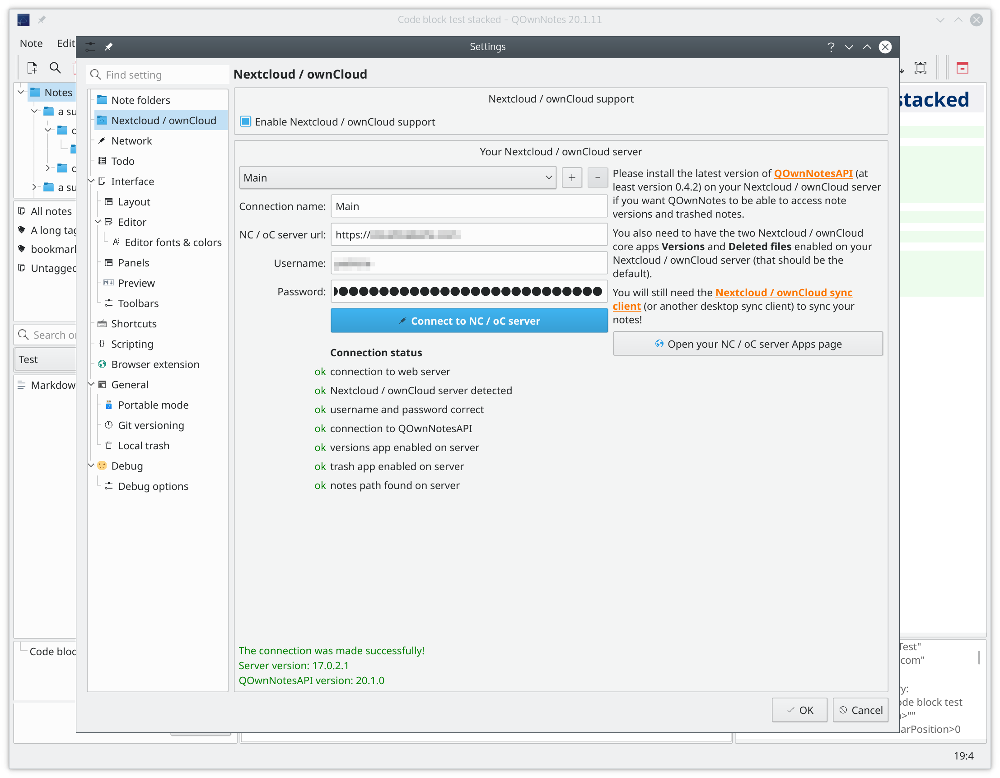

# [QOwnNotesAPI](http://www.qownnotes.org "QOwnNotes Offical Site")

[Changelog](https://github.com/pbek/qownnotesapi/blob/develop/CHANGELOG.md) |
[Issues](https://github.com/pbek/qownnotesapi/issues) |
[Download](https://github.com/pbek/qownnotesapi/releases) |
[ownCloud Apps page](https://marketplace.owncloud.com/apps/qownnotesapi) |
[Nextcloud Apps page](https://apps.nextcloud.com/apps/qownnotesapi)

[](https://codeclimate.com/github/pbek/qownnotesapi)
[](https://codeclimate.com/github/pbek/qownnotesapi/coverage)

QOwnNotesAPI is the Nextcloud / ownCloud API App for [QOwnNotes](http://www.qownnotes.org), the open source notepad for Linux, macOS and Windows, that works together with the notes application of Nextcloud/ownCloud.

The only purpose of this App is to provide API access to your Nextcloud / ownCloud server for your QOwnNotes desktop installation, you cannot use this Nextcloud / ownCloud App for anything else, if you don't have QOwnNotes installed on your desktop computer!

## Installation from git repository

You may only want this if you don't want to use the Nextcloud / ownCloud store!

Clone the app into your Nextcloud / ownCloud apps directory:

```bash
git clone https://github.com/pbek/qownnotesapi.git apps/qownnotesapi -b main
```

Activate the app:

```bash
occ app:enable qownnotesapi
```

## Screenshot



## Disclaimer

This SOFTWARE PRODUCT is provided by THE PROVIDER "as is" and "with all faults." THE PROVIDER makes no representations or warranties of any kind concerning the safety, suitability, lack of viruses, inaccuracies, typographical errors, or other harmful components of this SOFTWARE PRODUCT.

There are inherent dangers in the use of any software, and you are solely responsible for determining whether this SOFTWARE PRODUCT is compatible with your equipment and other software installed on your equipment. You are also solely responsible for the protection of your equipment and backup of your data, and THE PROVIDER will not be liable for any damages you may suffer in connection with using, modifying, or distributing this SOFTWARE PRODUCT.
